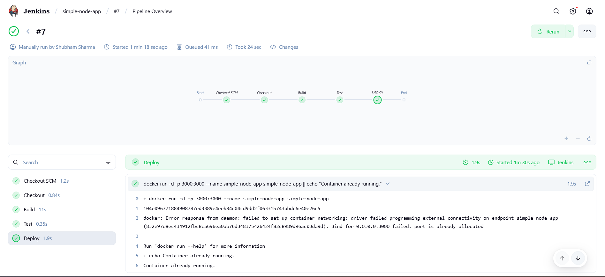
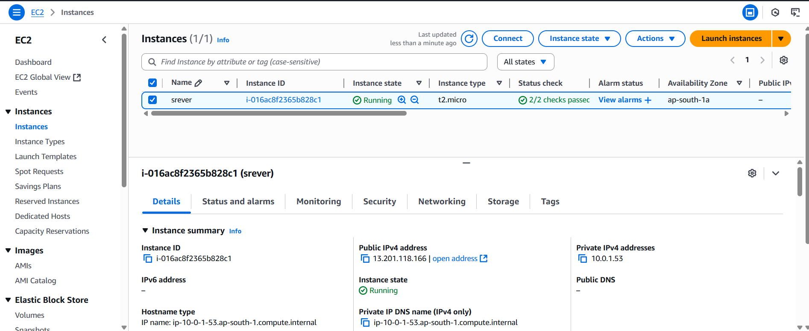
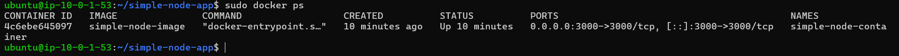
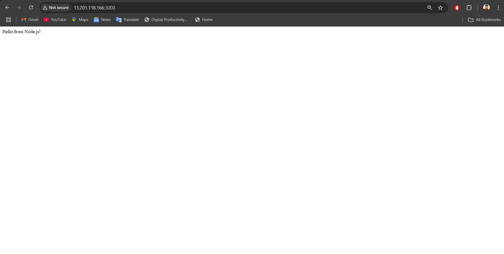

# Jenkins CI/CD Pipeline - Task 2

## 🚀 Objective
Automate the build, test, and deployment of a simple application using Jenkins and Docker.

## 🛠 Tools Used
- Jenkins
- Docker
- GitHub

## 📁 Project Structure
- `app.js` – Simple app code
- `Dockerfile` – Containerize the app
- `Jenkinsfile` – Defines the CI/CD stages

## ⚙️ Pipeline Stages
1. **Checkout** – Pulls code from GitHub
2. **Build** – Builds Docker image
3. **Test** – Runs sample tests (can be extended)
4. **Deploy** – Runs container on port 3000

## 🧪 Testing
- Pushed changes to repo
- Jenkins pipeline triggered automatically
- Verified build and deployment success in Jenkins dashboard

## ✅ Outcome
- Learned how to automate deployments using Jenkins
- Understood how Docker integrates with CI/CD pipelines

## Deployment Screenshots

## Jenkins Pipeline Overview

## AWS EC2 Instance Details

## Docker Container Status

## Application Running in Browser

